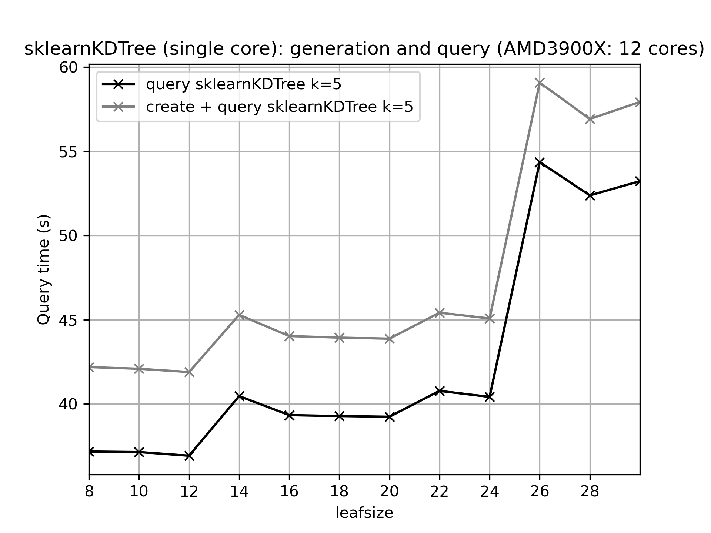
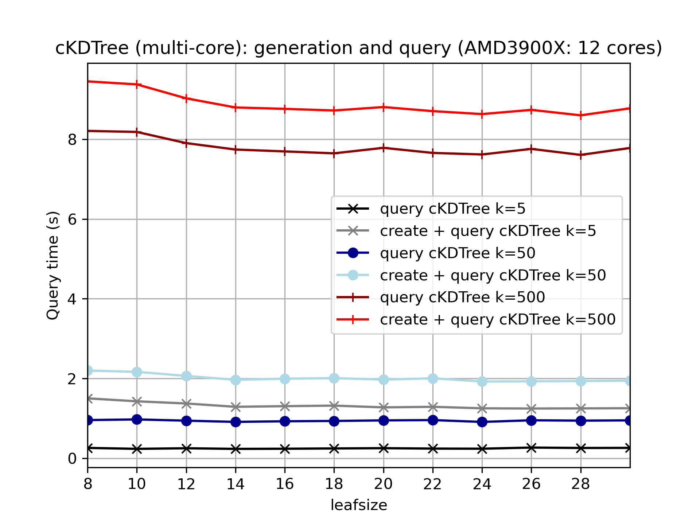
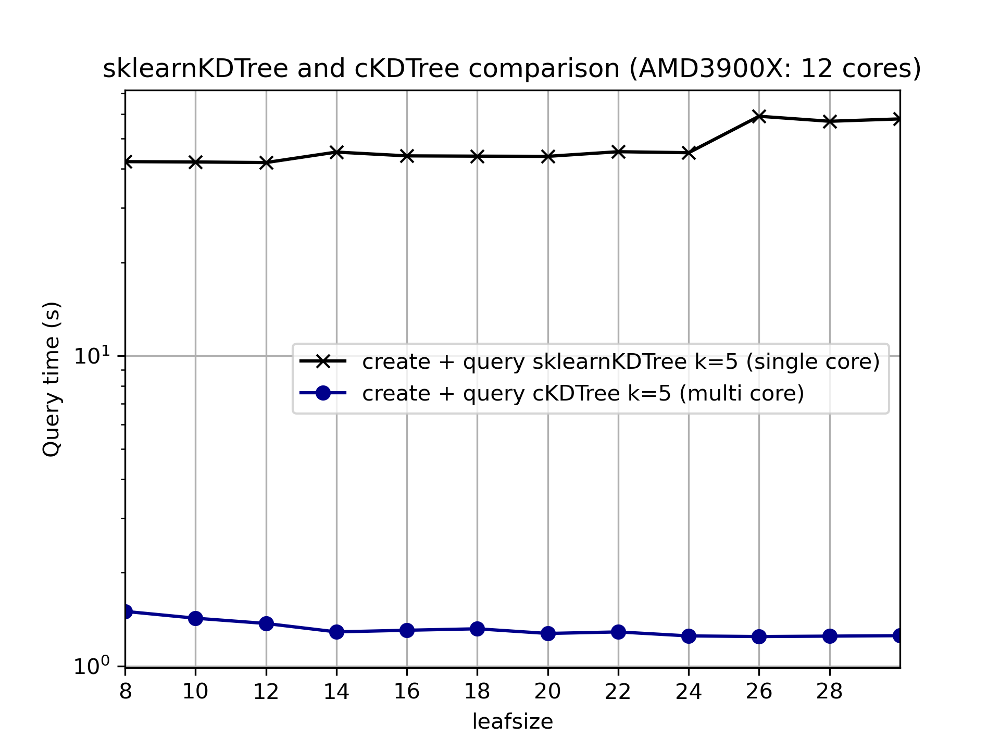
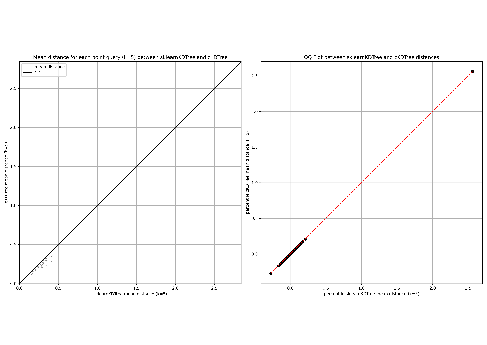

---
title: "Comparing Python KD-Tree Implementations with Focus on Point Cloud Processing"
subtitle: What is the most effective way to process lidar and SfM point clouds?
author: "Bodo Bookhagen, [bodo.bookhagen@uni-potsdam.de](bodo.bookhagen@uni-potsdam.de), University of Potsdam"
date: "Oct-18-2020"
footnotes-pretty: true
listings-disable-line-numbers: false
titlepage: true
toc-own-page: true
book: false
header-left: "Comparing Python KD-Tree Implementations"
footer-left: "Bodo Bookhagen"
logo-width: 350
disable-header-and-footer: false
lang: "en"
header-includes: |
  \usepackage[table]{xcolor}
  \usepackage{booktabs,caption,threeparttable}
  \captionsetup{labelfont=bf, justification=raggedright, singlelinecheck=false}

...
\tableofcontents
\newpage
\listoffigures
\newpage
\listoftables
\newpage

# Introduction and Motivation: LidarPC-KDTree
Comparison of KDTree implementations for Lidar PointClouds (PC) and Structure-from-Motion (SfM) dataset.

One of the core processing steps for irregular PC is to understand the neighborhood for each point (kNN - k-Nearest-Neighbors). This is often done using [KD Trees](https://en.wikipedia.org/wiki/K-d_tree). There exist myriad of implementations for various applications and KD Trees have become an important tool for Deep Learning that have been implemented in [kNN (k-nearest neighbor)](https://en.wikipedia.org/wiki/K-nearest_neighbors_algorithm) algorithms. Many of the approaches have been optimized for multi-dimensional datasets (n>5 and up to 50). In the recent months and years, KD-Trees relying on [CUDA](https://en.wikipedia.org/wiki/CUDA) or [OpenCL](https://en.wikipedia.org/wiki/OpenCL) implementations have become more coming and easily approachable through Python or Matlab interfaces.

**Here, we briefly explore existing algorithms and test, which one perform favorable for 3D lidar PC (or SfM PC). We only use three dimensions (x, y, z), but future implementation may rely on four (intensity) or higher dimensional lidar PC. We focus on implementations accessible through Python or C.**

We note that there exist other algorithm and parameter comparisons (e.g. [knn-benchmarking in python](https://jakevdp.github.io/blog/2013/04/29/benchmarking-nearest-neighbor-searches-in-python/) and [knn-benchmarking](http://mccormickml.com/2017/09/08/knn-benchmarks-part-1/)) and these are very useful and helpful -- but these are neither tailored for lidar/SfM PC nor have been using recent implementations. Most comparison also focus on the general applicability of KD-Tree algorithm and explore the impact of leaf sizes and dimensionality - both parameters do not change for lidar PC.

# Environment Installation
See [miniconda installation instructions](https://up-rs-esp.github.io/posts/2020/10/conda-install/) to setup an environment for processing. The installation of the python codes is done through conda on a Ubuntu 18.04 LTS system (also tested on 20.04 LTS).

Conda installation:
```
cconda create -y -n PC_py3 -c anaconda -c conda-forge -c defaults ipython spyder python=3.8 gdal=3 numpy scipy dask h5py pandas pytables hdf5 cython matplotlib tabulate scikit-learn pykdtree pyflann cyflann scikit-image opencv ipywidgets scikit-learn gmt=6* imagemagick
```
Next:
```
conda activate PC_py3
pip install laspy
pip install tables
```

# Methods and Approach
We construct the following scenarios:
1. Deriving k=5,10,50,100,500,1000 nearest neighbors from four lidar/SfM point clouds with 14e6, 38e6, 69e6, and 232e6 (million) points.
2. We time the generation of a KD-Tree and the queries separately for each.
3. Searching for neighbors within a given search radius/sphere (not supported by all algorithms).
4. The k-nearest neighbors can be used to estimate point-density or perform further classification on the neighborhood structure of points (e.g., curvature)

**We note that we query the tree with all points (e.g., k=50 neighbors for all points) and thus create large queries for neighborhood statistical analysis.**

An incomplete list of available algorithms and implementations. *Note: We have not used all of them for the tests, because some implementations are very slow and mostly for instructive/teaching purposes.*
Also, in all instances we have used the standard options and parameters, but these may not always be the most useful ones.

| Name | Reference and Documentation | Comments |
|:---|:---|:----------|
|scipy.spatial.KDTree| [Manual](https://docs.scipy.org/doc/scipy/reference/generated/scipy.spatial.KDTree.html#scipy.spatial.KDTree) | Pure Python implementation of KD tree. Querying is very slow and usage is not suggested. Not used.*Single core CPU processing.* |
|scipy.spatial.cKDTree | [Manual](https://docs.scipy.org/doc/scipy/reference/generated/scipy.spatial.cKDTree.html#scipy.spatial.cKDTree) | KDTree implementation in Cython. *Single and Multi-core CPU processing.* |
|sklearn.neighbors.KDTree | [Manual](https://scikit-learn.org/stable/modules/generated/sklearn.neighbors.KDTree.html) | KDTree implementation in sklearn. *Single core CPU processing.* |
|pyKDTree | [github page](https://github.com/storpipfugl/pykdtree) and [pypi project page](https://pypi.org/project/pykdtree/#description) |  fast implementation for common use cases (low dimensions and low number of neighbours) for both tree construction and queries. The implementation is based on scipy.spatial.cKDTree and libANN by combining the best features from both and focus on implementation efficiency. *Multi-core CPU processing.*|
| pyflann | [github](https://github.com/primetang/pyflann) | pyflann is the python bindings for [FLANN - Fast Library for Approximate Nearest Neighbors](http://www.cs.ubc.ca/research/flann/) and [FLANN Manual 1.8.4](https://www.cs.ubc.ca/research/flann/uploads/FLANN/flann_manual-1.8.4.pdf) *Multi-core CPU processing.* |
| cyflann | [github](https://github.com/dougalsutherland/cyflann) | cyflann is the a cython interface for [FLANN - Fast Library for Approximate Nearest Neighbors](http://www.cs.ubc.ca/research/flann/) and [FLANN Manual 1.8.4](https://www.cs.ubc.ca/research/flann/uploads/FLANN/flann_manual-1.8.4.pdf). *Multi-core CPU processing.* |
| NearestNeighbors | [cuml-kNN](https://docs.rapids.ai/api/cuml/nightly/api.html#nearest-neighbors) | GPU implementaiton of knn via [rapidsai](https://github.com/rapidsai), *currently only supports brute-force algorithm and is not competitive* |

Table: List of KD Tree Python implementations

# Test datasets
## Lidar and SfM Point Clouds from the University of Potsdam Campus Golm

The dense and high-resolution point clouds have been generated between 2018-2020 for parts of the University of Potsdam Campus Golm. These represent mixed-urban environments with building and vegetation. The files are too large for github and have been stored on Dropbox (links provided below).

| Name | PC Type | # of points | Point Density [pts/m2] | Link
|:---|:---|---:|---:|
| Golm_May06_2018 | Airborne Lidar | 14,437,532 | 61 | [Dropbox Link](https://www.dropbox.com/s/ocfj1kpfsap63pz/ALS_Golm_May06_2018_Milan_UTM33N_WGS84_6digit_cl_clip.laz?dl=0)
|mavicpro2 | Mavic Pro2, Agisoft Photoscan, high quality processing setting, images from nadiar and 15 degree angle taken | 38,334,551 | 219 | [Dropbox Link](https://www.dropbox.com/s/yxgpmxmz5bv2pnh/mavicpro2_nadir_15deg_highq_dense_PC_10cm_aligned2.laz?dl=0)
| mavicpro2_06Sept2019 | Mavic Pro2, Agisoft Photoscan, high quality processing setting | 69,482,218 | 707 | [Dropbox Link](https://www.dropbox.com/s/ydbez1tsnqiacjk/Golm_sept06_2019_highquality_agressivefiltering_aligned.laz?dl=0)
| inspire2 | Inspire 2, high quality processing, 1031 images | 232,269,911 | 988 | [Dropbox Link 2 GB!](https://www.dropbox.com/s/r8kjcxxs01a9g5h/inspire2_1031cameras_highq_dense_pc.laz?dl=0)

Table: List of Point clouds from the University of Potsdam Campus Golm.

## Airborne Lidar data from Santa Cruz Island, California
The airborne point cloud from Santa Cruz Island, California represents a natural terrain without buildings, but lower density. The  dataset contains 3,348,668 points with a point-density of 7.2 pts/m^2 and has been ground-classified using [LAStools](https://rapidlasso.com/lastools/). The points have been colored using an airphoto from the same time as the lidar flight.
The test area is from a small subset of the Pozo catchment in the southwestern part of the island. These data are openly accessibly and available from [opentopography](https://opentopography.org/) and were originally acquired by the USGS in 2010. The geologic and geomorphic environment and setting of the Santa Cruz Island has been described in several peer-reviewed scientific publications (e.g., [Perroy et al., 2010](https://doi.org/10.1016/j.geomorph.2010.01.009),  [Perroy et al., 2012](https://doi.org/10.1080/00045608.2012.715054), [Neely et al., 2017](https://doi.org/10.1002/2017JF004250), [Rheinwalt et al., 2019](https://agupubs.onlinelibrary.wiley.com/doi/abs/10.1029/2018JF004827), [Clubb et al., 2019](https://doi.org/10.1029/2019JF005025)).


# Results
We ran tests on a AMD Ryzen Threadripper 2970WX 24-Core Processor (2019) with a NVIDIA Titan RTX 24 GB running Ubuntu 18.04 (CUDA 10.1) and a AMD Ryzen 9 3900X 12-Core Processor with a NVIDIA GeForce RTX 2080 SUPER running Ubuntu 20.04 (CUDA 11.0).

## Subset of Pozo catchments (n=3,348,668 points)
A first test using standard single-core and multi-core algorithms for n=3,348,668 queries for n=3,348,668 points. Note that the KDTree calculations from *scipy.spatial.KDTree* have note been included, because they were too slow. Also, for the single-core *sklearnKDTree* approach, no higher number of neighbors have been included (too slow). All results show times in seconds (s) and have been averaged over n=3 runs.

### Summary of Results
Comparing the traditional and widely used _sklearnKDTree_ (single core), _cKDTree_ (multi core), _pyKDTree_ (multi core), and FLANN approaches we note the following results:
1. The leaf size is an important parameter to speed up single-core querying trees. Depending on point cloud structure, different leaf sizes provide very different results and can improve query times. We note that the default leaf size does not generate useful results for real-world airborne lidar data and that there exists a minimum time representing an optimal leaf size (cf. Figure \ref{pc_sklearnKDTree_AMD3900X_12cores}).
2. The _sklearnKDTree_ (single core) is slow on these massive queries. The option `dualtree=True` has been used to speed up processing.
3. _cKDtree_ with `jobs=-1` set for querying outperforms single-core approaches - especially on modern multi-core systems. Leaf size does not have a significant impact on multi-core processing, but some for larger neighborhood queries (k>100) (cf. Figures \ref{pc_cKDTree_AMD3900X_12cores} and {pc_sklearnKDTree_cKDTree_k5_AMD3900X_12cores}).
4. There are minimal difference between different approach. For example. the max. difference between _sklearnKDTree_ and _cKDTree_ is 0.2m and the median difference is 0.0 (see Figure \ref{pc_mean_distance_sklearnKDTree_cKDTree_leafsize16_k5_AMD3900X_12cores}).
5. Comparing _cKDTree_ with 12, 24, and 48 core processors indicates a clear advantage of multi-threading processes. (cf. Figure \ref{pc_pyKDTree_k5_k50_vcores}). We emphasize that in order to take full advantage of multi-threading processes, an increase in available DRAM is needed (i.e., more cores require more DRAM). We note that _pyKDTree_ has lower peak memory requirement than _cKDTree_.
6. The FLANN (Fast Library for Approximate Nearest Neighbors) family of approaches provides additional advancements, especially for large datasets and massive queries.
7. Initial tests with cuML (CUDA RAPIDS) show that the implemented brute-force approach for nearest neighbor searches is not competitive against the multi-core approaches (_cKDTree_ and _pyKDTree_) and highly optimized FLANN approaches. But there are other processing advantages of data analysis using  CUDA Dataframes (cudf).










|  Algorithm     |   Generate KDTree (s) |   Query k=5 (s) |   Query k=10 (s) |   Query k=50 (s) |   Query k=100 (s) |   Query k=500 (s) |   Query k=1000 (s) |
| :--------------|----------------------:|----------------:|-----------------:|-----------------:|------------------:|------------------:|-------------------:|
|  KDTree        |                5.25    |          nan    |           nan    |           nan    |            nan    |            nan    |             nan    |
|  sklearnKDTree |                  1.51 |           36.93 |           nan    |           nan    |            nan    |            nan    |             nan    |
|  **cKDTree**       |                  0.32 |            0.23 |             0.31 |             0.91 |              1.67 |              7.47 |              15.13 |
|  pyKDTree      |                  0.07 |            0.23 |             0.32 |             1.1  |              2.58 |             35.17 |             129.81 |
|  pyflannKDTree |                  0.19 |            0.17 |             0.24 |             0.97 |              2.11 |             12.54 |              27.4  |
|  cyflannKDTree |                  0.26 |            0.2  |             0.26 |             1    |              2.2  |              9.69 |              20.01 |

Table: Comparison of fastest processing times (any leaf size) for all implemented algorithms in seconds. Note that the scipy standard _KDTree_ has not been processed due to the very slow processing times. All times are the average of 3 iterations.


|  Algorithm     |   Generate KDTree (s) |   Query k=5 (s) |   Query k=10 (s) |   Query k=50 (s) |   Query k=100 (s) |   Query k=500 (s) |   Query k=1000 (s) |
| :--------------|----------------------:|----------------:|-----------------:|-----------------:|------------------:|------------------:|-------------------:|
|  KDTree        |                  5.25 |          nan    |           nan    |           nan    |            nan    |            nan    |             nan    |
|  sklearnKDTree |                  1.67 |           54.35 |           nan    |           nan    |            nan    |            nan    |             nan    |
|  cKDTree       |                  0.41 |            0.27 |             0.39 |             0.97 |              1.78 |              8.21 |              17.64 |
|  pyKDTree      |                  0.12 |            0.26 |             0.34 |             1.17 |              2.69 |             35.78 |             131.58 |
|  pyflannKDTree |                  0.19 |            0.17 |             0.24 |             0.97 |              2.11 |             12.54 |              27.4  |
|  cyflannKDTree |                  0.26 |            0.2  |             0.26 |             1    |              2.2  |              9.69 |              20.01 |

Table: Worst (slowest times in seconds) for any processing steps - mostly reflecting the impact of leaf sizes.


|  Algorithm     |   Generate KDTree (s) |   Query k=5 (s) |   Query k=10 (s) |   Query k=50 (s) |   Query k=100 (s) |   Query k=500 (s) |   Query k=1000 (s) |
| :--------------|----------------------:|----------------:|-----------------:|-----------------:|------------------:|------------------:|-------------------:|
|  sklearnKDTree |                  0.16 |           17.43 |           nan    |           nan    |            nan    |            nan    |             nan    |
|  cKDTree       |                  0.1  |            0.03 |             0.08 |             0.06 |              0.12 |              0.74 |               2.51 |
|  pyKDTree      |                  0.05 |            0.02 |             0.01 |             0.07 |              0.12 |              0.61 |               1.77 |

Table: Range of times between different leaf sizes. Most notable differences are for the single core _sklearnKDTree_ approach.


|  Algorithm     |   Generate KDTree (# leafsize) |   Query k=5 (# leafsize) |   Query k=10 (# leafsize) |   Query k=50 (# leafsize) |   Query k=100 (# leafsize) |   Query k=500 (# leafsize) |   Query k=1000 (# leafsize) |
| :--------------|-------------------------------:|-------------------------:|--------------------------:|--------------------------:|---------------------------:|---------------------------:|----------------------------:|
|  KDTree        |                             10 |                        8 |                         8 |                         8 |                          8 |                          8 |                           8 |
|  cKDTree       |                             36 |                       14 |                        16 |                        24 |                         14 |                         38 |                          38 |
|  sklearnKDTree |                             28 |                       12 |                         8 |                         8 |                          8 |                          8 |                           8 |
|  pyKDTree      |                             36 |                       16 |                        20 |                        16 |                         28 |                         26 |                          32 |

Table: Best leaf sizes (fastest times). Note the differences for varying numbers of neighbors.


### Comparing pyKDTree and cKDTree for 12, 24, and 40 cores


### Comparing multi-core cKDTree and multi-core FLANN (Fast Library for Approximate Nearest Neighbors) approaches


# Codes
**All Python codes are available on the github repository [LidarPC-KDTree](https://github.com/UP-RS-ESP/LidarPC-KDTree).**

We setup separate functions for the generation of KDTrees:
```python
def pc_generate_KDTree(pc_xyz, leafsizei=10):
    try:
        from scipy import spatial
    except ImportError:
        raise pc_generate_KDTree("scipy not installed.")
    pc_xyz_KDTree_tree = spatial.KDTree(pc_xyz, leafsize=leafsizei)
    return pc_xyz_KDTree_tree

def pc_query_KDTree(pc_xyz_KDTree_tree, pc_xyz, k=10):
    pc_kdtree_distance, pc_kdtree_id = pc_xyz_KDTree_tree.query(pc_xyz, k=k)
    return pc_kdtree_distance, pc_kdtree_id

def pc_generate_sklearnKDTree(pc_xyz, leafsizei=10):
    #conda install scikit-learn
    try:
        from sklearn.neighbors import KDTree as sklearnKDTree
    except ImportError:
        raise pc_generate_sklearnKDTree("sklearn not installed.")
    pc_xyz_sklearnKDTree_tree = sklearnKDTree(pc_xyz, leaf_size=leafsizei)
    return pc_xyz_sklearnKDTree_tree

def pc_query_sklearnKDTree(pc_xyz_sklearnKDTree_tree, pc_xyz, k=10):
    pc_sklearnKDTree_distance, pc_sklearnKDTree_id = pc_xyz_sklearnKDTree_tree.query(pc_xyz, k=k, dualtree=True)
    return pc_sklearnKDTree_distance, pc_sklearnKDTree_id

def pc_generate_cKDTree(pc_xyz, leafsizei=10):
    try:
        from scipy import spatial
    except ImportError:
        raise pc_generate_cKDTree("scipy not installed.")
    pc_xyz_cKDTree_tree = spatial.cKDTree(pc_xyz, leafsize=leafsizei)
    return pc_xyz_cKDTree_tree

def pc_query_cKDTree(pc_xyz_cKDTree_tree, pc_xyz, k=10):
    pc_cKDTree_distance, pc_cKDTree_id = pc_xyz_cKDTree_tree.query(pc_xyz, k=k, n_jobs=-1)
    return pc_cKDTree_distance, pc_cKDTree_id

def pc_generate_pyKDTree(pc_xyz, leafsizei=10):
    try:
        from pykdtree.kdtree import KDTree as pyKDTree
    except ImportError:
        raise pc_generate_pyKDTree("pykdtree not installed.")
    pc_xyz_pyKDTree_tree = pyKDTree(pc_xyz, leafsize=leafsizei)
    return pc_xyz_pyKDTree_tree

def pc_query_pyKDTree(pc_xyz_pyKDTree_tree, pc_xyz, k=10):
    pc_pyKDTree_distance, pc_pyKDTree_id = pc_xyz_pyKDTree_tree.query(pc_xyz, k=k)
    return pc_pyKDTree_distance, pc_pyKDTree_id

def pc_generate_pyflannKDTree(pc_xyz):
    #conda install -y -c conda-forge pyflann
    try:
        import pyflann
    except ImportError:
        raise pc_generate_pyflannKDTree("pyflann not installed.")
    pyflann.set_distance_type('euclidean')
    pc_xyz_pyflannKDTree_tree = pyflann.FLANN()
    pc_xyz_pyflannKDTree_tree.build_index(pc_xyz, algorithm='kdtree_single', trees=8)
    return pc_xyz_pyflannKDTree_tree

def pc_query_pyflannKDTree(pc_xyz_pyflannKDTree_tree, pc_xyz, k=10):
    pc_pyflannKDTree_id, pc_pyflannKDTree_distance = pc_xyz_pyflannKDTree_tree.nn_index(pc_xyz, k)
    return  pc_pyflannKDTree_distance, pc_pyflannKDTree_id

def pc_generate_cyflannKDTree(pc_xyz):
    #conda install -y -c conda-forge cyflann
    try:
        import cyflann
    except ImportError:
        raise pc_generate_cyflannKDTree("pyflann not installed.")
    cyflann.set_distance_type('euclidean')
    pc_xyz_cyflannKDTree_tree = cyflann.FLANNIndex()
    pc_xyz_cyflannKDTree_tree.build_index(pc_xyz, algorithm='kdtree_single', trees=8)
    return pc_xyz_cyflannKDTree_tree

def pc_query_cyflannKDTree(pc_xyz_cyflannKDTree_tree, pc_xyz, k=10):
    pc_cyflannKDTree_id, pc_cyflannKDTree_distance = pc_xyz_cyflannKDTree_tree.nn_index(pc_xyz, k)
    return pc_cyflannKDTree_distance, pc_cyflannKDTree_id
```

Next, we setup wrapping functions for the timer:

```python
def wrapper(func, *args, **kwargs):
    def wrapped():
        return func(*args, **kwargs)
    return wrapped
```

And function for loading in LAS/LAZ files (if laszip is installed):
```python
def load_LAS(las_fname, dtype='float32'):
    """
    Load LAS or LAZ file (only coordinates) and return pc_xyz and xy vectors. Converts float64 to float32 by default, unless you set dtype='float64'
    """
    from laspy.file import File

    inFile = File(las_fname, mode='r')
    pc_pc_xyz = np.vstack((inFile.get_x()*inFile.header.scale[0]+inFile.header.offset[0], inFile.get_y()*inFile.header.scale[1]+inFile.header.offset[1], inFile.get_z()*inFile.header.scale[2]+inFile.header.offset[2])).transpose()

    #setting datatype to float32 to save memory.
    if dtype == 'float32':
        pc_pc_xyz = pc_pc_xyz.astype('float32')
    return pc_pc_xyz
```

Additionally, if you want to run this from the command line:
```python
def cmdLineParser():
    parser = argparse.ArgumentParser(description='Compare KDTree algorithms for lidar or SfM PointClouds (PC). B. Bookhagen (bodo.bookhagen@uni-potsdam.de), Aug 2019.')
    parser.add_argument('-i', '--inlas', type=str, default='Pozo_WestCanada_clg.laz',  help='LAS/LAZ file with point-cloud data.')
    parser.add_argument('--nr_of_repetitions', type=int, default=5,  help='Number of repititions')
    parser.add_argument('--hdf_filename', type=str, default='Pozo_WestCanada_clg_kdresults_5rep.hdf',  help='Output HDF file containting results from iterations.')
    parser.add_argument('--csv_filename', type=str, default='Pozo_WestCanada_clg_kdresults_5rep.csv',  help='Output CSV file containting results from iterations.')
    parser.add_argument('--nr_of_repetitions_generate', type=int, default=1,  help='Number of repititions used for generating index. Set to 1 to avoid caching effects.')
    return parser.parse_args()
```

We load the LAS pointcloud:
```python
print('Loading input file: %s... '%inps.inlas, end='', flush=True)
pc_xyz = load_LAS(inps.inlas, dtype='float32')
print('loaded %s points'%"{:,}".format(pc_xyz.shape[0]))
```

And run some iterations for _sklearn_:
```python
#Run sklearnKDTree
pc_generate_sklearnKDTree_time = np.empty( (len(leafrange), 1) )
pc_generate_sklearnKDTree_time[:] = np.nan
pc_query_sklearnKDTree_k5_time = np.empty( (len(leafrange), 1) )
pc_query_sklearnKDTree_k5_time[:] = np.nan
pc_query_sklearnKDTree_k10_time = np.empty( (len(leafrange), 1) )
pc_query_sklearnKDTree_k10_time[:] = np.nan
pc_query_sklearnKDTree_k50_time = np.empty( (len(leafrange), 1) )
pc_query_sklearnKDTree_k50_time[:] = np.nan
pc_query_sklearnKDTree_k100_time = np.empty( (len(leafrange), 1) )
pc_query_sklearnKDTree_k100_time[:] = np.nan
pc_query_sklearnKDTree_k500_time = np.empty( (len(leafrange), 1) )
pc_query_sklearnKDTree_k500_time[:] = np.nan
pc_query_sklearnKDTree_k1000_time = np.empty( (len(leafrange), 1) )
pc_query_sklearnKDTree_k1000_time[:] = np.nan
pc_query_sklearnKDTree_k5_stats = np.empty( (len(leafrange), len(pc_xyz), 5) )
pc_query_sklearnKDTree_k5_stats[:] = np.nan
pc_query_sklearnKDTree_k10_stats = np.empty( (len(leafrange), len(pc_xyz), 5) )
pc_query_sklearnKDTree_k10_stats[:] = np.nan

leaf_counter = 0
for leafsizei in leafrange:
    print('\n\tGenerating sklearnKDTree... with leafsize = %d (%dx) '%(leafsizei, inps.nr_of_repetitions_generate), end='', flush=True)
    wrapped = wrapper(pc_generate_sklearnKDTree, pc_xyz, leafsizei)
    pc_generate_sklearnKDTree_time[leaf_counter] = timeit.timeit(wrapped, number=inps.nr_of_repetitions_generate)
    pc_xyz_sklearnKDTree_tree = pc_generate_sklearnKDTree(pc_xyz, leafsizei=leafsizei)
    print('time (average of %d runs): %0.3fs or %0.2fm'%(inps.nr_of_repetitions_generate, pc_generate_sklearnKDTree_time[leaf_counter]/inps.nr_of_repetitions, pc_generate_sklearnKDTree_time[leaf_counter]/inps.nr_of_repetitions/60))

    print('\tQuerying sklearnKDTree with k=5 for all points (%dx)... '%(inps.nr_of_repetitions), end='', flush=True)
    wrapped = wrapper(pc_query_sklearnKDTree, pc_xyz_sklearnKDTree_tree, pc_xyz, k=5)
    pc_query_sklearnKDTree_k5_time[leaf_counter] = timeit.timeit(wrapped, number=inps.nr_of_repetitions)
    print('time (average of %d runs): %0.3fs or %0.2fm'%(inps.nr_of_repetitions, pc_query_sklearnKDTree_k5_time[leaf_counter]/inps.nr_of_repetitions, pc_query_sklearnKDTree_k5_time[leaf_counter]/inps.nr_of_repetitions/60))
    pc_sklearnKDTree_distance, pc_sklearnKDTree_id = pc_query_sklearnKDTree(pc_xyz_sklearnKDTree_tree, pc_xyz, k=5)
    pc_query_sklearnKDTree_k5_stats[leaf_counter, :, 0] = np.mean(pc_sklearnKDTree_distance, axis=1)
    pc_query_sklearnKDTree_k5_stats[leaf_counter, :, 1] = np.std(pc_sklearnKDTree_distance, axis=1)
    pc_query_sklearnKDTree_k5_stats[leaf_counter, :, 2] = np.percentile(pc_sklearnKDTree_distance, [25], axis=1)
    pc_query_sklearnKDTree_k5_stats[leaf_counter, :, 3] = np.percentile(pc_sklearnKDTree_distance, [50], axis=1)
    pc_query_sklearnKDTree_k5_stats[leaf_counter, :, 4] = np.percentile(pc_sklearnKDTree_distance, [75], axis=1)
    pc_sklearnKDTree_distance = None
    pc_sklearnKDTree_id = None

    pc_xyz_sklearnKDTree_tree = None
    leaf_counter += 1
```

Results can be plotted with:
```python
plt.clf()
plt.plot(leafrange, pc_query_sklearnKDTree_k5_time/inps.nr_of_repetitions, 'kx-', label='query sklearnKDTree k=5')
plt.plot(leafrange, (pc_query_sklearnKDTree_k5_time)/inps.nr_of_repetitions+pc_generate_sklearnKDTree_time/inps.nr_of_repetitions_generate, 'x-', c='gray', label='create + query sklearnKDTree k=5')
plt.title('sklearnKDTree (single core): generation and query (AMD3900X: 12 cores)')
plt.grid()
plt.xlabel('leafsize')
plt.ylabel('Query time (s)')
plt.xlim([8,30])
plt.xticks(np.arange(8,30,step=2))
#plt.ylim([0,2])
plt.legend()
plt.savefig('figs/pc_sklearnKDTree_AMD3900X_12cores.png', dpi=300, orientation='landscape')
```

For _cKDTree_ we perform a more exhaustive analysis:
```python
#Run cKDTree (cython implementation from scipy)
pc_generate_cKDTree_time = np.empty( (len(leafrange), 1) )
pc_generate_cKDTree_time[:] = np.nan
pc_query_cKDTree_k5_time = np.empty( (len(leafrange), 1) )
pc_query_cKDTree_k5_time[:] = np.nan
pc_query_cKDTree_k10_time = np.empty( (len(leafrange), 1) )
pc_query_cKDTree_k10_time[:] = np.nan
pc_query_cKDTree_k50_time = np.empty( (len(leafrange), 1) )
pc_query_cKDTree_k50_time[:] = np.nan
pc_query_cKDTree_k100_time = np.empty( (len(leafrange), 1) )
pc_query_cKDTree_k100_time[:] = np.nan
pc_query_cKDTree_k500_time = np.empty( (len(leafrange), 1) )
pc_query_cKDTree_k500_time[:] = np.nan
pc_query_cKDTree_k1000_time = np.empty( (len(leafrange), 1) )
pc_query_cKDTree_k1000_time[:] = np.nan
pc_query_cKDTree_k5_stats = np.empty( (len(leafrange), len(pc_xyz), 5) )
pc_query_cKDTree_k5_stats[:] = np.nan
pc_query_cKDTree_k10_stats = np.empty( (len(leafrange), len(pc_xyz), 5) )
pc_query_cKDTree_k10_stats[:] = np.nan

leaf_counter = 0
for leafsizei in leafrange:
    print('\n\tGenerating cKDTree with leafsize = %d ... (%dx) '%(leafsizei, inps.nr_of_repetitions_generate), end='', flush=True)
    wrapped = wrapper(pc_generate_cKDTree, pc_xyz, leafsizei)
    pc_generate_cKDTree_time[leaf_counter] = timeit.timeit(wrapped, number=inps.nr_of_repetitions_generate)
    pc_xyz_cKDTree_tree = pc_generate_cKDTree(pc_xyz, leafsizei=leafsizei)
    print('time (average of %d runs): %0.3fs or %0.2fm'%(inps.nr_of_repetitions_generate, pc_generate_cKDTree_time[leaf_counter]/inps.nr_of_repetitions, pc_generate_cKDTree_time[leaf_counter]/inps.nr_of_repetitions/60))

    print('\tQuerying cKDTree with k=5 for all points (%dx)... '%(inps.nr_of_repetitions), end='', flush=True)
    wrapped = wrapper(pc_query_cKDTree, pc_xyz_cKDTree_tree, pc_xyz, k=5)
    pc_query_cKDTree_k5_time[leaf_counter] = timeit.timeit(wrapped, number=inps.nr_of_repetitions)
    print('time (average of %d runs): %0.3fs or %0.2fm'%(inps.nr_of_repetitions, pc_query_cKDTree_k5_time[leaf_counter]/inps.nr_of_repetitions, pc_query_cKDTree_k5_time[leaf_counter]/inps.nr_of_repetitions/60))
    pc_cKDTree_distance, pc_cKDTree_id = pc_query_cKDTree(pc_xyz_cKDTree_tree, pc_xyz, k=5)
    pc_query_cKDTree_k5_stats[leaf_counter, :, 0] = np.mean(pc_cKDTree_distance, axis=1)
    pc_query_cKDTree_k5_stats[leaf_counter, :, 1] = np.std(pc_cKDTree_distance, axis=1)
    pc_query_cKDTree_k5_stats[leaf_counter, :, 2] = np.percentile(pc_cKDTree_distance, [25], axis=1)
    pc_query_cKDTree_k5_stats[leaf_counter, :, 3] = np.percentile(pc_cKDTree_distance, [50], axis=1)
    pc_query_cKDTree_k5_stats[leaf_counter, :, 4] = np.percentile(pc_cKDTree_distance, [75], axis=1)
    pc_cKDTree_distance = None
    pc_cKDTree_id = None

    print('\tQuerying cKDTree with k=10 for all points (%dx)... '%(inps.nr_of_repetitions), end='', flush=True)
    wrapped = wrapper(pc_query_cKDTree, pc_xyz_cKDTree_tree, pc_xyz, k=10)
    pc_query_cKDTree_k10_time[leaf_counter] = timeit.timeit(wrapped, number=inps.nr_of_repetitions)
    print('time (average of %d runs): %0.3fs or %0.2fm'%(inps.nr_of_repetitions, pc_query_cKDTree_k10_time[leaf_counter]/inps.nr_of_repetitions, pc_query_cKDTree_k10_time[leaf_counter]/inps.nr_of_repetitions/60))
    pc_cKDTree_distance, pc_cKDTree_id = pc_query_cKDTree(pc_xyz_cKDTree_tree, pc_xyz, k=10)
    pc_query_cKDTree_k10_stats[leaf_counter, :, 0] = np.mean(pc_cKDTree_distance, axis=1)
    pc_query_cKDTree_k10_stats[leaf_counter, :, 1] = np.std(pc_cKDTree_distance, axis=1)
    pc_query_cKDTree_k10_stats[leaf_counter, :, 2] = np.percentile(pc_cKDTree_distance, [25], axis=1)
    pc_query_cKDTree_k10_stats[leaf_counter, :, 3] = np.percentile(pc_cKDTree_distance, [50], axis=1)
    pc_query_cKDTree_k10_stats[leaf_counter, :, 4] = np.percentile(pc_cKDTree_distance, [75], axis=1)
    pc_cKDTree_distance = None
    pc_cKDTree_id = None

    print('\tQuerying cKDTree with k=50 for all points (%dx)... '%(inps.nr_of_repetitions), end='', flush=True)
    wrapped = wrapper(pc_query_cKDTree, pc_xyz_cKDTree_tree, pc_xyz, k=50)
    pc_query_cKDTree_k50_time[leaf_counter] = timeit.timeit(wrapped, number=inps.nr_of_repetitions)
    print('time (average of %d runs): %0.3fs or %0.2fm'%(inps.nr_of_repetitions, pc_query_cKDTree_k50_time[leaf_counter]/inps.nr_of_repetitions, pc_query_cKDTree_k50_time[leaf_counter]/inps.nr_of_repetitions/60))

    print('\tQuerying cKDTree with k=100 for all points (%dx)... '%(inps.nr_of_repetitions), end='', flush=True)
    wrapped = wrapper(pc_query_cKDTree, pc_xyz_cKDTree_tree, pc_xyz, k=100)
    pc_query_cKDTree_k100_time[leaf_counter] = timeit.timeit(wrapped, number=inps.nr_of_repetitions)
    print('time (average of %d runs): %0.3fs or %0.2fm'%(inps.nr_of_repetitions, pc_query_cKDTree_k100_time[leaf_counter]/inps.nr_of_repetitions, pc_query_cKDTree_k100_time[leaf_counter]/inps.nr_of_repetitions/60))

    print('\tQuerying cKDTree with k=500 for all points (%dx)... '%(inps.nr_of_repetitions), end='', flush=True)
    wrapped = wrapper(pc_query_cKDTree, pc_xyz_cKDTree_tree, pc_xyz, k=500)
    pc_query_cKDTree_k500_time[leaf_counter] = timeit.timeit(wrapped, number=inps.nr_of_repetitions)
    print('time (average of %d runs): %0.3fs or %0.2fm'%(inps.nr_of_repetitions, pc_query_cKDTree_k500_time[leaf_counter]/inps.nr_of_repetitions, pc_query_cKDTree_k500_time[leaf_counter]/inps.nr_of_repetitions/60))

    print('\tQuerying cKDTree with k=1000 for all points (%dx)... '%(inps.nr_of_repetitions), end='', flush=True)
    wrapped = wrapper(pc_query_cKDTree, pc_xyz_cKDTree_tree, pc_xyz, k=1000)
    pc_query_cKDTree_k1000_time[leaf_counter] = timeit.timeit(wrapped, number=inps.nr_of_repetitions)
    print('time (average of %d runs): %0.3fs or %0.2fm'%(inps.nr_of_repetitions, pc_query_cKDTree_k1000_time[leaf_counter]/inps.nr_of_repetitions, pc_query_cKDTree_k1000_time[leaf_counter]/inps.nr_of_repetitions/60))
    pc_xyz_cKDTree_tree = None
    leaf_counter += 1

pc_cKDTree_time_df = pd.DataFrame({'index': range(len(leafrange)), 'leafsize': leafrange,
    'pc_query_cKDTree_k5_time': pc_query_cKDTree_k5_time.ravel(),
    'pc_query_cKDTree_k10_time': pc_query_cKDTree_k10_time.ravel(),
    'pc_query_cKDTree_k50_time': pc_query_cKDTree_k50_time.ravel(),
    'pc_query_cKDTree_k100_time': pc_query_cKDTree_k100_time.ravel(),
    'pc_query_cKDTree_k500_time': pc_query_cKDTree_k500_time.ravel(),
    'pc_query_cKDTree_k1000_time': pc_query_cKDTree_k1000_time.ravel(),
    'pc_generate_cKDTree_time': pc_generate_cKDTree_time.ravel()})
pc_cKDTree_time_df.to_hdf('pc_cKDTree_time_df_%s.hdf'%(inps.cpuname), key='pc_cKDTree_time_df', complevel=9)

#For simplicity, save array to npy
np.save('pc_query_cKDTree_k5_stats_%s.npy'%(inps.cpuname),pc_query_cKDTree_k5_stats)
np.save('pc_query_cKDTree_k10_stats_%s.npy'%(inps.cpuname),pc_query_cKDTree_k10_stats)
```
Note that we also save the results to a pandas dataframe and the results of the queries for k=5 and k=10 to a .npy file.

This is repeated for _pyKDTree_ (see Python code in github).

The generation of figures is outlined in [python/plot_py_and_cKDTree_variouscores.py]() and
